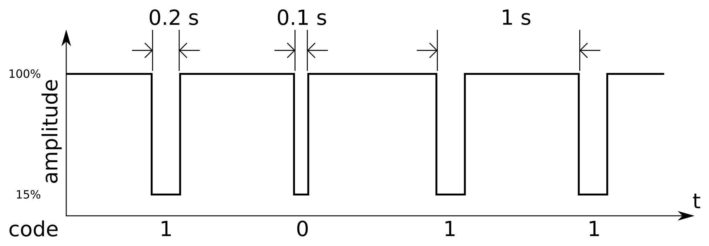

# How does your wall clock know the time?

## Radio-controlled clocks

* Cheap clocks, watches, weather stations that are always right: no internet, no GPS, just a small longwave antenna
* In central Europe they listen to **DCF77**: **D**eutschland, **C**all sign for radio clocks, **F**rankfurt, at **77**.5 kHz
* Transmitter in Mainflingen (55 km from Mainz!), operated on behalf of [PTB](https://www.ptb.de/), Germany's national metrology institute
* On air since 1959, steered by atomic clocks, reaches ~2000 km — most of Europe
* Similar stations elsewhere: MSF (UK), WWVB (US), JJY (Japan)

## One bit per second

* At the start of every second the carrier amplitude drops briefly:
    * drop for 0.1 s → bit `0`
    * drop for 0.2 s → bit `1`
* Second 59: no drop at all — that silence marks the start of the next minute
* 59 bits per minute ≈ **1 baud**: possibly the slowest data stream you rely on daily
* Each minute transmits the date and time of the *following* minute (other protcols are different!)

## Signal amplitude example



## The 60-bit format{.scrollable}

| Bits  | Meaning                                                  |
|-------|----------------------------------------------------------|
| 0     | Start of minute, always `0`                              |
| 1–14  | Civil warning bits, encrypted weather forecast           |
| 15    | Call bit (transmitter abnormality)                       |
| 16    | Summer time announcement                                 |
| 17–18 | CEST / CET flags                                         |
| 19    | Leap second announcement                                 |
| 20    | Start of time information, always `1`                    |
| 21–28 | Minutes (BCD) + parity                                   |
| 29–35 | Hours (BCD) + parity                                     |
| 36–57 | Day of month, day of week, month, year in century (BCD)  |
| 58    | Date parity                                              |
| 59    | Not transmitted (minute marker)                          |

# `RadioClock.jl`

## What it is

* A pure-Julia decoder *and* encoder for the DCF77 time code: [github.com/giordano/RadioClock.jl](https://github.com/giordano/RadioClock.jl)
* `DCF77Data`: the whole 60-bit signal stored in a single `UInt64`, constructible from an integer or a binary string
* `decode` / `encode` convert between `DCF77Data` and `ZonedDateTime`
* Scope: it works on the *bits* — pair it with a radio/SDR front end to get them off the air
* Fast: decoding a signal takes < 50ns

## Decoding a signal

A minute's worth of bits, as received on 2025-07-17:

```{julia}
#| echo: true
using RadioClock
data = DCF77Data("000000000000000001001000100100000011111010001111001010010010")
RadioClock.decode(DCF77, data)
```

The pretty-printing of `DCF77Data` gives the answer away, too:

```{julia}
#| echo: true
data
```

## Consistency checks

* Fixed bits are correct (0, 20, 59)
* Even parity of minutes, hours, and date fields
* Exactly one of the CET / CEST flags is set, consistently with the actual DST rules for the decoded instant
* Transmitted day of week matches the decoded date

```{julia}
#| error: true
#| echo: true
corrupted = DCF77Data(data.x ⊻ (UInt64(1) << 21))  # noise flipped one bit
RadioClock.decode(DCF77, corrupted)
```

## Time zones-aware

* `decode` returns a `ZonedDateTime`, not a `DateTime`
* The CET/CEST flags are cross-checked against the real Europe/Berlin transition rules from [`TimeZones.jl`](https://github.com/JuliaTime/TimeZones.jl)
* The summer time announcement bit must agree with an actual upcoming transition
* The year is represented with only two digits: the signal itself is ambiguous, `RadioClock.jl` assumes 2000–2099

## Encoding: the round trip

Generating the signal for a given time:

```{julia}
#| echo: true
using TimeZones
talk = ZonedDateTime(2026, 8, 14, 10, 30, tz"Europe/Berlin")
signal = RadioClock.encode(DCF77, talk)
```

```{julia}
#| echo: true
RadioClock.decode(DCF77, signal) == talk
```

Handy for generating test data

## Implementation notes

* The whole signal is one `UInt64`: masks and shifts, no arrays, no allocations
* Small reusable helpers: 2-digit BCD encode/decode, even parity over a bit range
* `DCF77` is an empty struct, a subtype of `RadioSignal`, used purely for dispatch:

   ```{.julia code-line-numbers="false"}
   decode(::Type{DCF77}, data::DCF77Data) -> ZonedDateTime
   encode(::Type{DCF77}, zdt::ZonedDateTime) -> DCF77Data
   ```

## Live demo time

# Conclusions

:::: {.columns}

::: {.column width="60%"}
* Wishlist: more signals behind the same `RadioSignal` abstraction
    * MSF (60 kHz, UK), WWVB (60 kHz, US), JJY (40/60 kHz, Japan)
* Give it a try:

```{.julia code-line-numbers="false"}
using Pkg
Pkg.add(url = "https://github.com/giordano/RadioClock.jl")
```
:::

::: {.column width="5%"}
:::

::: {.column width="35%"}


<https://github.com/giordano/RadioClock.jl>
:::

::::

<!-- Local Variables: -->
<!-- mode: markdown -->
<!-- auto-fill-function: nil -->
<!-- End: -->
